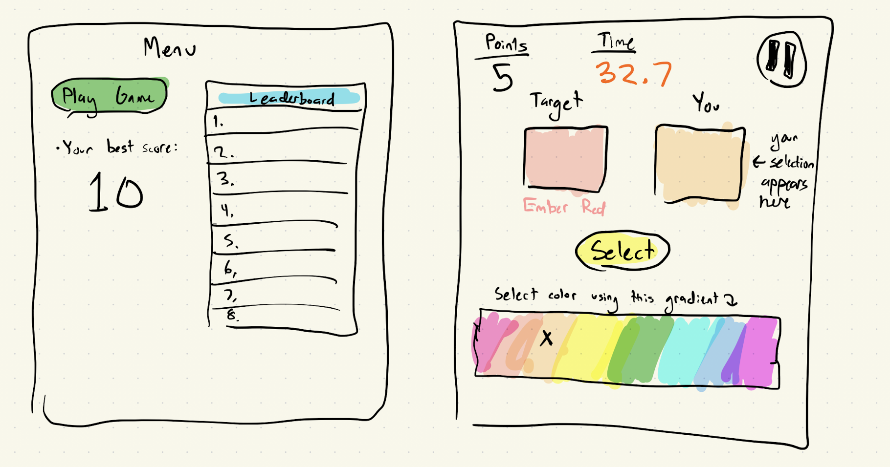
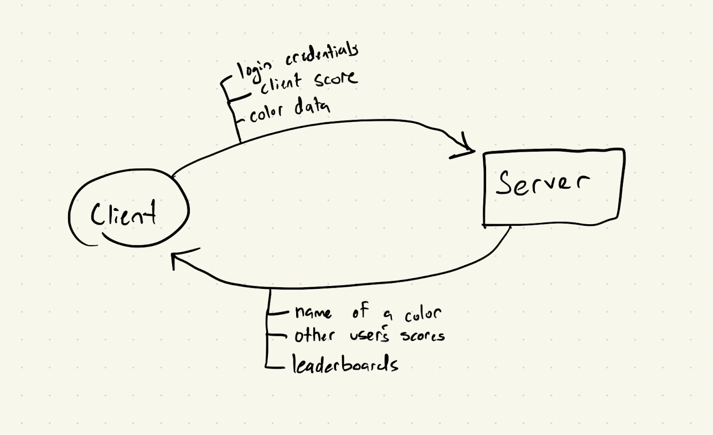

# Huey

[My Notes](notes.md)

> [!NOTE]
>  If you are not familiar with Markdown then you should review the [documentation](https://docs.github.com/en/get-started/writing-on-github/getting-started-with-writing-and-formatting-on-github/basic-writing-and-formatting-syntax) before continuing.

## 🚀 Specification Deliverable

For this deliverable I did the following. I checked the box `[x]` and added a description for things I completed.

- [X] Proper use of Markdown
- [X] A concise and compelling elevator pitch
- [X] Description of key features
- [X] Description of how you will use each technology
- [X] One or more rough sketches of your application. Images must be embedded in this file using Markdown image references.

### Elevator pitch

Sometimes we just need something to stimulate and entertain our minds for a very
short amount of time that doesn't involve infinite doomscrolling. Meet Huey! Huey is a game where you have two squares: one contains the target color, and the other's color can be changed by you! You have exactly 60 seconds to get as many matches as you can. Exceptionally skilled players will have their name immortalized on the global leaderboard for all to see!

### Design

The main menu contains a button to play the game, a leaderboard showing the top scores, and the player's personal best score. The actual game consists of two squares, one of which shows the target color, and the other displays the selected color. An interactive color gradient allows the user to change the selected color until they feel it matches with the target color, where they then press submit to see if they passed. Successful matches add a point to the point counter and changes the target color. Game is played until the timer (starting at 60s) reaches zero. 

### Key features

- An interactive color gradient allows users to select colors (the crux of the gameplay)
- Global top scores and personal high scores are stored in a database
- Secure login to save and post scores

### Technologies

I am going to use the required technologies in the following ways.

- **HTML** - 4 HTML Pages. One for login, one for main menu, one for leaderboards, one for gameplay
- **CSS** - Making the app look good. Most important aspect is adding the color gradient for picking colors.
- **JavaScript** - Interactivity. Adds button clicking functions, for example
- **React** - Reactivity. Key features will be login live updates to the score counter
- **Service** - Saves scores and updates leaderboards. Provides the name of a color using The Color API (http://www.thecolorapi.com)
- **DB/Login** - Registers users and stores their credentials securely in a database. High scores will be stored in a database.
- **WebSocket** - Websocket: alerts players to new scores acheived by other players

## 🚀 AWS deliverable

For this deliverable I did the following. I checked the box `[x]` and added a description for things I completed.

- [ ] **Server deployed and accessible with custom domain name** - [My server link](https://yourdomainnamehere.click).

## 🚀 HTML deliverable

For this deliverable I did the following. I checked the box `[x]` and added a description for things I completed.

- [X] **HTML pages** - Multiple pages for home page, instructions, game, and leaderboard
- [X] **Proper HTML element usage** - HTML elements were used to populate the HTML pages with necessary information and future mechanics
- [X] **Links** - Navigation menu on every HTML page 
- [X] **Text** - Text was included, such as gameplay instructions
- [X] **3rd party API placeholder** - a placeholder for the API provided color name was provided over the two color squares
- [X] **Images** - an image was on every webpage
- [X] **Login placeholder** - Login placeholder provided on the home webpage
- [X] **DB data placeholder** - DB placeholder provided in the leaderboard page
- [X] **WebSocket placeholder** - Gameplay updates located in the game page

## 🚀 CSS deliverable

For this deliverable I did the following. I checked the box `[x]` and added a description for things I completed.

- [X] **Header, footer, and main content body** - All stylized and functional with necessary information. 
- [X] **Navigation elements** -Navigation elements included in header
- [X] **Responsive to window resizing** - Header and Footer are responsive to window resizing
- [X] **Application elements** - Leaderboard, game controls, login now look pretty
- [X] **Application text content** - Text elements are also stylized
- [X] **Application images** - Small paint pallette logo on top corner of every page

## 🚀 React part 1: Routing deliverable

For this deliverable I did the following. I checked the box `[x]` and added a description for things I completed.

- [X] **Bundled using Vite** - Vite used for bundling.
- [X] **Components** - Components implemented.
- [X] **Router** - Routing between login and voting components.

## 🚀 React part 2: Reactivity

For this deliverable I did the following. I checked the box `[x]` and added a description for things I completed.

- [ ] **All functionality implemented or mocked out** - I did not complete this part of the deliverable.
- [ ] **Hooks** - I did not complete this part of the deliverable.

## 🚀 Service deliverable

For this deliverable I did the following. I checked the box `[x]` and added a description for things I completed.

- [ ] **Node.js/Express HTTP service** - I did not complete this part of the deliverable.
- [ ] **Static middleware for frontend** - I did not complete this part of the deliverable.
- [ ] **Calls to third party endpoints** - I did not complete this part of the deliverable.
- [ ] **Backend service endpoints** - I did not complete this part of the deliverable.
- [ ] **Frontend calls service endpoints** - I did not complete this part of the deliverable.

## 🚀 DB/Login deliverable

For this deliverable I did the following. I checked the box `[x]` and added a description for things I completed.

- [ ] **User registration** - I did not complete this part of the deliverable.
- [ ] **User login and logout** - I did not complete this part of the deliverable.
- [ ] **Stores data in MongoDB** - I did not complete this part of the deliverable.
- [ ] **Stores credentials in MongoDB** - I did not complete this part of the deliverable.
- [ ] **Restricts functionality based on authentication** - I did not complete this part of the deliverable.

## 🚀 WebSocket deliverable

For this deliverable I did the following. I checked the box `[x]` and added a description for things I completed.

- [ ] **Backend listens for WebSocket connection** - I did not complete this part of the deliverable.
- [ ] **Frontend makes WebSocket connection** - I did not complete this part of the deliverable.
- [ ] **Data sent over WebSocket connection** - I did not complete this part of the deliverable.
- [ ] **WebSocket data displayed** - I did not complete this part of the deliverable.
- [ ] **Application is fully functional** - I did not complete this part of the deliverable.
